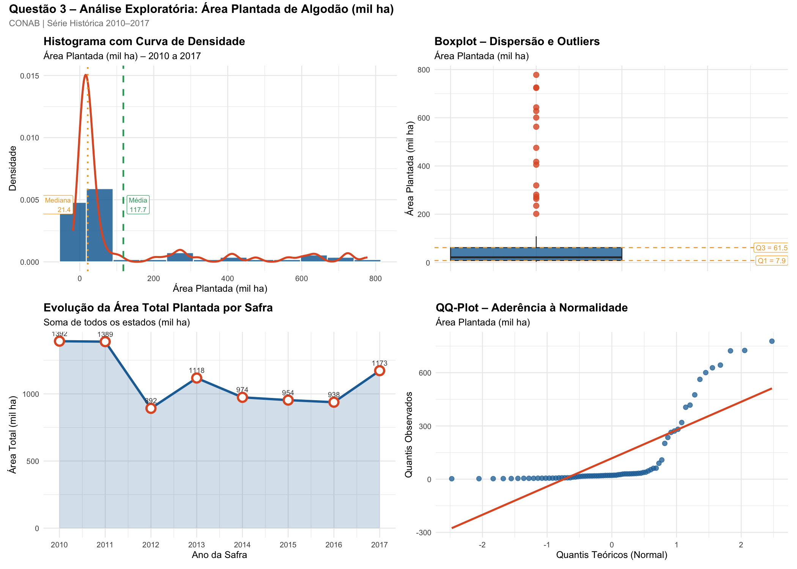
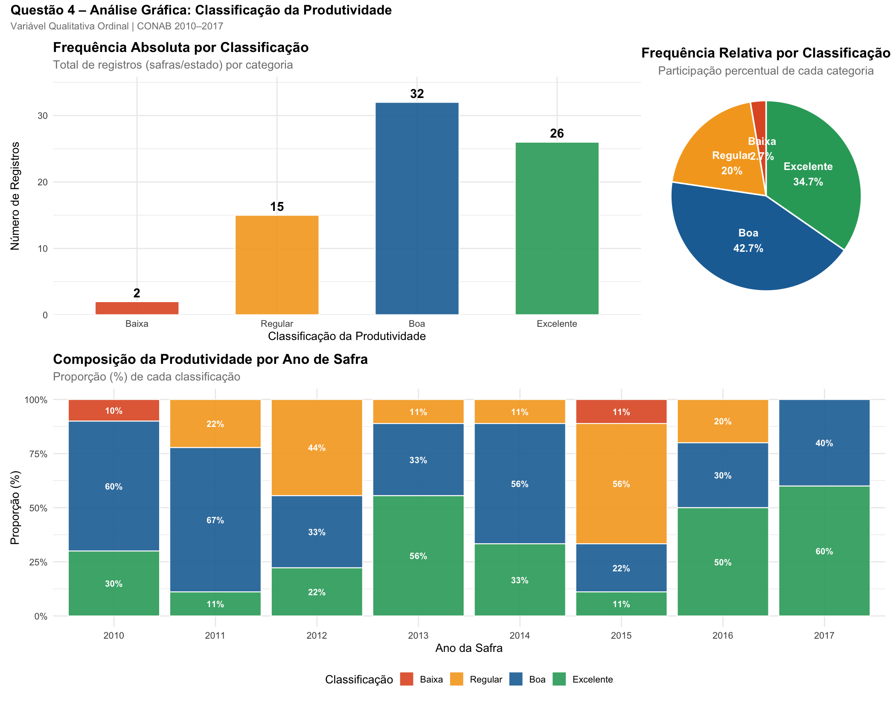

# FIAP - Faculdade de Informática e Administração Paulista

<p align="center">
<a href= "https://www.fiap.com.br/"></a>
</p>

<br>

# Cap 7 - Decolando com ciências de dados

## Grupo 98

## 👨‍🎓 Integrantes: 
- <a href="https://www.linkedin.com/company/inova-fusca">Eduardo Venancio Leite</a> 
- <a href="https://www.linkedin.com/company/inova-fusca">Francisco José Bittencourt Corrêa</a>
- <a href="https://www.linkedin.com/company/inova-fusca">Jullyana de Azevedo Rodrigues</a>
- <a href="https://www.linkedin.com/in/kaiquecadimiel/">Kaique Cadimiel Amasio de Souza</a>

## 👩‍🏫 Professores:
### Tutor(a) 
- <a href="https://www.linkedin.com/company/inova-fusca">Nicolly Candida Rodrigues de Souza</a>
### Coordenador(a)
- <a href="https://www.linkedin.com/company/inova-fusca">ANDRÉ GODOI CHIOVATO</a>

## 📜 Descrição

Este projeto consiste em uma **Análise Exploratória de Dados (AED)** da série histórica do algodão em caroço no Brasil, abrangendo o período de 2010 a 2017. Utilizando dados oficiais da **CONAB (Companhia Nacional de Abastecimento)**, o estudo busca compreender o comportamento do setor através de indicadores estatísticos e visualizações de dados.

O foco da análise divide-se em dois pilares principais:
1.  **Análise Quantitativa (Área Plantada):** Estudo detalhado da distribuição da área ocupada pela cultura (em mil hectares), aplicando medidas de tendência central (média, mediana, moda), dispersão (variância, desvio padrão, coeficiente de variação) e separatrizes (quartis, decis e percentis). Além disso, são avaliadas a assimetria e a curtose da distribuição.
2.  **Análise Qualitativa (Produtividade):** Classificação do desempenho produtivo dos estados brasileiros em categorias (Baixa, Regular, Boa, Excelente), permitindo uma visão estratégica sobre a eficiência agrícola regional ao longo dos anos.

A solução foi desenvolvida em **linguagem R**, utilizando bibliotecas como `ggplot2` para visualizações ricas, `dplyr` para manipulação de dados e `patchwork` para a composição de painéis analíticos complexos. O objetivo final é fornecer uma base sólida de informações para a tomada de decisão no agronegócio e demonstrar a aplicação prática de técnicas de Ciência de Dados em cenários reais.


## 📁 Estrutura de pastas

Dentre os arquivos e pastas presentes na raiz do projeto, definem-se:

- <b>.github</b>: Nesta pasta ficarão os arquivos de configuração específicos do GitHub que ajudam a gerenciar e automatizar processos no repositório.

- <b>assets</b>: aqui estão os arquivos relacionados a elementos não-estruturados deste repositório, como imagens.

- <b>config</b>: Posicione aqui arquivos de configuração que são usados para definir parâmetros e ajustes do projeto.

- <b>document</b>: aqui estão todos os documentos do projeto que as atividades poderão pedir. Na subpasta "other", adicione documentos complementares e menos importantes.

- <b>scripts</b>: Posicione aqui scripts auxiliares para tarefas específicas do seu projeto. Exemplo: deploy, migrações de banco de dados, backups.

- <b>src</b>: Todo o código fonte criado para o desenvolvimento do projeto ao longo das 7 fases.

- <b>README.md</b>: arquivo que serve como guia e explicação geral sobre o projeto (o mesmo que você está lendo agora).

## 🔧 Como executar o código

Para executar a análise, certifique-se de ter o [R](https://www.r-project.org/) instalado em sua máquina.

### Pré-requisitos

Instale os pacotes necessários executando o seguinte comando no console do R:

```r
install.packages(c("readxl", "ggplot2", "dplyr", "scales", "patchwork", "e1071"))
```

### Execução

1. Abra o terminal ou prompt de comando.
2. Navegue até a pasta `src` do projeto.
3. Execute o script utilizando o `Rscript`:

```bash
Rscript analise_algodao.R
```

Os resultados e gráficos gerados serão salvos na pasta `assets/` na raiz do projeto.

## 📊 Resultados da Análise

Abaixo estão os resultados consolidados da análise estatística da série histórica de algodão (2010-2017):

### Resumo Estatístico
```text
Dimensões: 75 linhas × 6 colunas
# A tibble: 5 × 6
     id   ano uf    area_mil_ha producao_mil_t class_produtividade
  <int> <int> <fct>       <dbl>          <dbl> <ord>              
1     1  2010 BA          405.          1611.  Excelente          
2     2  2010 CE            3.1            3.1 Baixa              
3     3  2010 GO          108.           429.  Excelente          
4     4  2010 MA           18.1           71.1 Boa                
5     5  2010 MG           31.6          116.  Boa                

──────────────────────────────────────────
  MEDIDAS DE TENDÊNCIA CENTRAL
──────────────────────────────────────────
  Média    : 117.73 mil ha
  Mediana  : 21.40 mil ha
  Moda*    : 6 mil ha  (* arredondado ao inteiro)

──────────────────────────────────────────
  MEDIDAS DE DISPERSÃO
──────────────────────────────────────────
  Variância             : 42407.7068
  Desvio Padrão         : 205.9313 mil ha
  Coef. de Variação     : 174.92%
  Amplitude Total       : 775.30 mil ha
  Amplitude Interquart. : 53.60 mil ha
  Assimetria (skewness) : 1.9442
  Curtose               : 2.4825

──────────────────────────────────────────
  MEDIDAS SEPARATRIZES
──────────────────────────────────────────

  Quartis:
    Q1 (25%)  : 7.90 mil ha
    Q2 (50%)  : 21.40 mil ha  ← mediana
    Q3 (75%)  : 61.50 mil ha

  Percentis selecionados:
    10%    : 4.80 mil ha
    25%    : 7.90 mil ha
    50%    : 21.40 mil ha
    75%    : 61.50 mil ha
    90%    : 452.18 mil ha

  Décis (D1 a D9):
    D1 (10% ): 4.80 mil ha
    D2 (20% ): 6.96 mil ha
    D3 (30% ): 14.48 mil ha
    D4 (40% ): 18.60 mil ha
    D5 (50% ): 21.40 mil ha
    D6 (60% ): 29.78 mil ha
    D7 (70% ): 39.10 mil ha
    D8 (80% ): 208.32 mil ha
    D9 (90% ): 452.18 mil ha
```

**Fonte dos dados:** [CONAB – Portal de Informações Agropecuárias](https://portaldeinformacoes.conab.gov.br/downloads/arquivos/SerieHistoricaGraos.txt)

### Visualizações Geradas
A análise gera dois painéis de indicadores localizados na pasta `assets/`:

1.  **Área Plantada (`painel_q3_area_plantada.png`):** Histogramas, Boxplots e análises de tendência da área ocupada pela cultura.
2.  **Produtividade (`painel_q4_produtividade.png`):** Análise da produção total versus produtividade por estado.

<p align="center">
  
  
</p>

## 🗃 Histórico de lançamentos

* 0.5.0 - XX/XX/2024
    * 
* 0.4.0 - XX/XX/2024
    * 
* 0.3.0 - XX/XX/2024
    * 
* 0.2.0 - XX/XX/2024
    * 
* 0.1.0 - XX/XX/2024
    *

## 📋 Licença

<p xmlns:cc="http://creativecommons.org/ns#" xmlns:dct="http://purl.org/dc/terms/"><a property="dct:title" rel="cc:attributionURL" href="https://github.com/agodoi/template">MODELO GIT FIAP</a> por <a rel="cc:attributionURL dct:creator" property="cc:attributionName" href="https://fiap.com.br">Fiap</a> está licenciado sobre <a href="http://creativecommons.org/licenses/by/4.0/?ref=chooser-v1" target="_blank" rel="license noopener noreferrer" style="display:inline-block;">Attribution 4.0 International</a>.</p>


